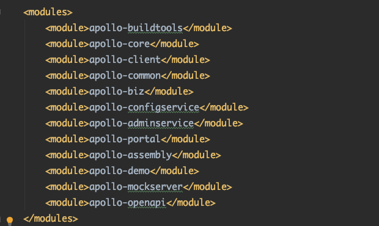
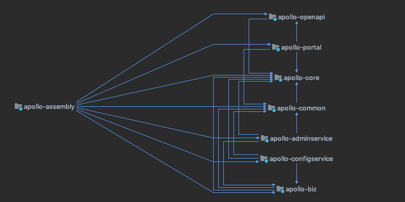
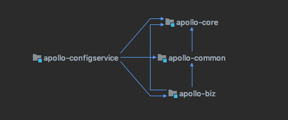

# Apollo Project


#### Apollo 是携程框架部门研发的分布式配置中心，能够集中化管理应用不同环境、不同集群的配置，配置修改后能够实时推送到应用端，并且具备规范的权限、流程治理等特性，适用于微服务配置管理场景。[github项目](https://github.com/ctripcorp/apollo)


> ### 模块划分

#### 首先我们看下Project的模块划分, pom.xml文件如下面所示，可以看出pom的文件依赖还是很多module

–


#### apollo-adminservice的依赖树是这样, Admin Service提供配置的修改、发布等功能，服务对象是Apollo Portal（管理界面）


#### apollo-assembly的依赖树如下




#### apollo-configservice的依赖树如下, Config Service提供配置的读取、推送等功能，服务对象是Apollo客户端. Config Service和Admin Service都是多实例、无状态部署，所以需要将自己注册到Eureka中并保持心跳




> ### 总体设计


#### ConfigService的主要服务方是Apollo的客户端，主要提供client的fetch和推送(这里的推送主要是依赖LongPolling的方式)，Client每次来fetch该api，得到结果后flush本地的value

```java
// client的req
ApolloNotificationMessages clientMessages = transformMessages(messagesAsString);

List<Release> releases = Lists.newLinkedList();
releases.add(currentAppRelease);
releases.add(publicRelease);

// audit release
auditReleases(appId, clusterName, dataCenter, clientIp, releases);

// merge release
ApolloConfig apolloConfig = new ApolloConfig(appId, appClusterNameLoaded, originalNamespace,
                                             mergedReleaseKey);
apolloConfig.setConfigurations(mergeReleaseConfigurations(releases));

return apolloConfig;
```

```java
// client的拉取数据是通过LongPolling的方式来fetch -> RemoteConfigLongPollService
m_longPollingService.submit(new Runnable() {
  @Override
  public void run() {
    if (longPollingInitialDelayInMills > 0) {
        logger.debug("Long polling will start in {} ms.", longPollingInitialDelayInMills);
        TimeUnit.MILLISECONDS.sleep(longPollingInitialDelayInMills);
    }
    doLongPollingRefresh(appId, cluster, dataCenter, secret);
  }
});

// doLongPollingRefresh
// 有阻止当前thread同时刷新的机制，5s屏蔽一次，之后重新申请
HttpRequest request = new HttpRequest(url);
request.setReadTimeout(LONG_POLLING_READ_TIMEOUT); // http request里设置了90s的超时

// 这里抽象了一个Transaction的概念，像事务一样，complete后会唤起自定义的某些逻辑
Transaction transaction = Tracer.newTransaction("Apollo.ConfigService", "pollNotification");

// call NotificationControllerV2.pollNotification,这里直接获取api
final HttpResponse<List<ApolloConfigNotification>> response =
  	m_httpUtil.doGet(request, m_responseType);

if (response.getStatusCode() == 200 && response.getBody() != null) {
    updateNotifications(response.getBody()); // 更新本地map
    // 保持deltaNotifications的更新，这里会merge每次的变更，更新后的notificationId要保持递增才能被正常替换
    updateRemoteNotifications(response.getBody());
    transaction.addData("Result", response.getBody().toString());
  	// 把消息丢出去，后面流程是把某些标示设置成true，强制flush。并且会尝试更新本地的文件，通知listener
  	// 这里的抽象做的不错，可以做参考来写event模型抽象
    notify(lastServiceDto, response.getBody());
}
```

#### 我们来看下NotificationControllerV2的server对于LongPolling的处理

```java
private static final int DEFAULT_LONG_POLLING_TIMEOUT = 60; //60s,server的超时配置是60s

DeferredResultWrapper deferredResultWrapper = new DeferredResultWrapper(bizConfig.longPollingTimeoutInMilli()); // Spring提供的Wrapper

    deferredResultWrapper
          .onTimeout(() -> logWatchedKeys(watchedKeys, "Apollo.LongPoll.TimeOutKeys"));

    deferredResultWrapper.onCompletion(() -> {
      //unregister all keys
      for (String key : watchedKeys) {
        deferredResults.remove(key, deferredResultWrapper);
      }
      logWatchedKeys(watchedKeys, "Apollo.LongPoll.CompletedKeys");
    });

    //register all keys
    for (String key : watchedKeys) {
      this.deferredResults.put(key, deferredResultWrapper);
    }

```


> ### client设计


> ### HA设计


> ### 方法


> ### 发发发

